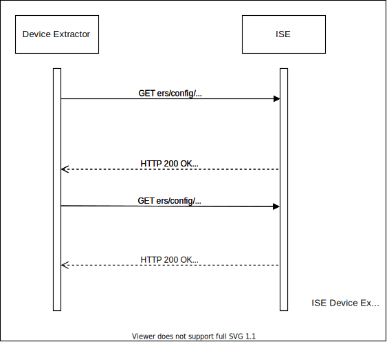
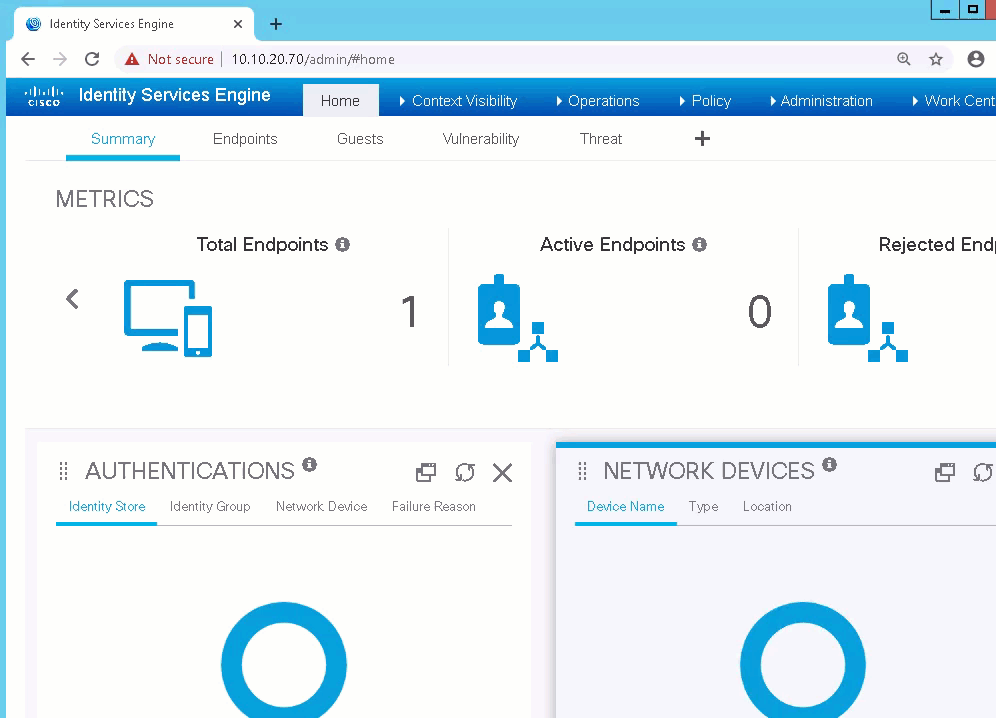
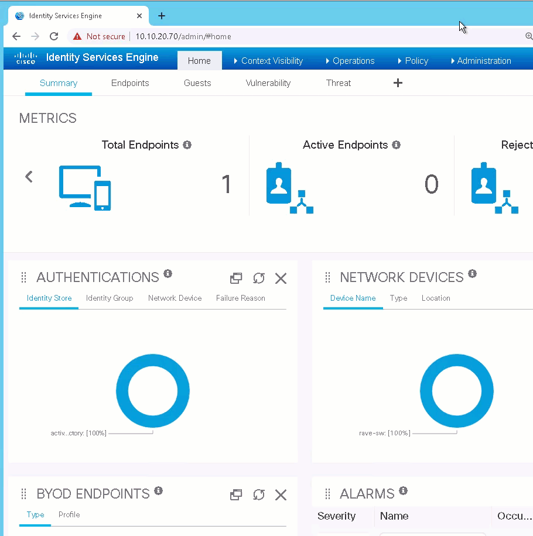

[](https://developer.cisco.com/codeexchange/github/repo/srmcnutt/ise_device_inventory)

```
   __   ___                               
| /__` |__                                
| .__/ |___                               
                                          
 __   ___         __   ___                
|  \ |__  \  / | /  ` |__                 
|__/ |___  \/  | \__, |___                
                                          
 ___     ___  __        __  ___  __   __  
|__  \_/  |  |__)  /\  /  `  |  /  \ |__) 
|___ / \  |  |  \ /~~\ \__,  |  \__/ |  \ v0.1
                                          
- by Steven McNutt, CCIE #6495. @densem0de on twitterz
```


# ISE Device extractor
This program extracts all of your network access devices from ISE
and creates an Ansible compatible YAML inventory file.  It's purpose is 
to use ISE as a source of truth for network automation.

Generally speaking, if you are using ISE to manage your network access devices,
it's likely you've got a fairly accurate inventory which is very useful.
Additonally, the location and device type network device groups map very
nicely to groups you would typically want to use for target selection.

Because [Ansible](https://www.ansible.com/resources/get-started) is the most 
widely used automation tool for systems and networks, extractor produces a YAML
inventory file that can parsed by Ansible. Since the inventory file is YAML,
it's fairly trivial to parse, so it can certainly be used by python scripts
and the like.

The program is designed so that it can operate either interactively, or as part of a pipeline.

notes:
1. It outputs status to console.
2. It will only ask for input if required information is missing.
3. All of it's parameters are configurable through environment variables, following [12 factor app](https://12factor.net/config) principles.

An example use would be to create a shell script that calls extractor to create
the inventory, then calls an Ansible playbook, giving you a dynamic inventory
that reflects the current state of the devices and groups in ISE.

---------------------------------------------------------------------------

  * [How it works](#how-it-works)
  * [Enabling ISE ERS API](#Enabling-the-ISE-ERS-API)
  * [Creating an ERS API User](#creating-an-ers-api-user)
  * [First time Python environment setup](#First-time-setup)
  * [Configuration and Environment Variables](#configuration-and-variables)
  * [Running the extractor](#running-the-extractor)
  * [Sample Output](#Sample-Output)
  * [Testing in the Devnet Sandbox](#testing-in-the-devnet-sandbox)

----------------------------------------------------------------------------

## How it works

Extractor makes two batches of API calls. First it retrieves the list of device
IDs from ISE.  Then it makes a second batch of calls using the device ids to get specific 
details about the devices.  This information is parsed and used to populate a list of 
nested dictionaries. Lastly, the data is converted to YAML
and dumped to disk. The data_ref folder contains some examples of what these data structures look like.

Activity diagram:



------------------------

## Configuration and variables
There are two places where configuration for the extractor can be defined.
1. config.yml
2. Environment variables

Environment variables take precedence over the configuration file. This is so you can
have a default configuration for interactive use, and different configuration when
used as part of a batch job or CI/CD pipeline.

The minimum configuration needed to use the program is to set the ise_node parameter in config.yml to the host name or ip address
of your primary administration node (you can get this information when you enable the ERS API, covered
later in the readme).

Note that Device Extractor will not read usernames and passwords from config.yml.  It will use environment
variables first, and if those are not present you'll get an interactive prompt when starting the program.

The following is the list of environment variables Device Extractor looks for at startup:

* ISE_NODE - the host name or ip address of ISE
* ISE_PATH - the path and file name where would like the output file to be written
* ISE_PAGE_LIMIT - the number of pages Device extractor will read before giving up
* ISE_USER - an ISE user with ERS Opertator rights
* ISE_PASSWORD - the password for the ISE_USER

---------

## Enabling the ISE ERS API
Before you can run device Extractor, you must enable the ERS API and give an admin user
rights to utilize the API.

To enable the ERS API
1. Log into ISE and to go Administration-->System-->Settings-->ERS Settings
2. Under general note the URL to access the ERS SDK.
   1. This is the ip address you want to use for your ise_node configuration
3. Click the "Enable ERS for Read/Write" Radio Button
4. Click Save



--------------------

## Creating an ERS API User
You need an ISE administrative user with ERS Operator or ERS Admin
rights to make API calls the ERS API.  To create perform the following steps:
1. Log into ISE and go to Administration-->System-->Admin Access
2. Under administrators select Admin Users
3. Click Add
4. Select Create an admin user
5. set a name
6. enter a password
7. Under admin groups click the drop down and select ERS Operator
8. Click Submit



-------------------

## First time setup
1. set up a virtual environment by entering: "python3 -m venv venv" at the bash shell
2. activate your environment with "source venv/bin/activate
3. install dependencies by typing "pip install -r requirements. txt"

You'll want to repeat step 2 whenever you start a new shell session and you want
to run the program.

------------------

## Running the extractor
To run the extrator, simply type "python main.py" at the bash shell.
Extractor will:

* connect to ISE
* Download and process the device information
* Write the YAML file
* Write a confirmation to the terminal
* Exit.

-----------------------

## Sample Output
Take a look at the hosts.yml file in the data_ref folder for an example
of what the output looks like.

-------------------------

## Testing in the Devnet Sandbox
A good way to get some hands on experience with the tool is to use one of the ISE reservable labs in the [Cisco Devnet Sandbox]
(https://devnetsandbox.cisco.com/).  The lab I like to use is Identity Services Engine with MUD.

--------------------
--------------------

May you be happy, and may you care for yourself with ease.

-s
